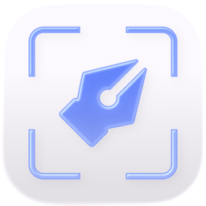

<p align="center">
  
</p>

<h1 align="center">Snapmark</h1>

<p align="center">
  <strong>A fast, lightweight image annotation and markup tool for macOS</strong>
</p>

<p align="center">
  
  
  
</p>

<!-- <p align="center">
  
</p> -->

---

## Features

### Annotation Tools
> 9 tools for quick image markup — shapes, text, arrows, blur, and more

- **Select & Move** — click to select overlays, drag to move, use handles to resize
- **Crop** — define a crop region with dimmed preview; Enter to apply, Esc to cancel
- **Blur** — drag a rectangle to blur sensitive areas with GPU-accelerated Gaussian blur
- **Text** — click to place, type inline, adjustable font size and color
- **Arrow** — click-drag from start to end; arrowhead scales with stroke width
- **Rectangle** — supports fill, stroke, and corner radius
- **Ellipse** — supports fill and stroke
- **Line** — stroke-only line between two points

All overlays are **non-destructive** — the base image is never modified until export.

---

### Import & Export
> Paste, annotate, copy — done in seconds

- **Paste** from clipboard (Cmd+V) — supports TIFF, PNG, and image URLs
- **Open** from file (Cmd+O) — PNG, JPEG, TIFF, BMP, GIF
- **Drag and drop** — load images by dragging onto the canvas
- **Copy** to clipboard (Cmd+C) — composited final image ready to paste anywhere
- **Save** to file (Cmd+S) — PNG with transparency or JPEG

---

### Canvas
> Smooth, zoomable canvas with Figma-like navigation

- Pinch-to-zoom and scroll-to-pan with trackpad support
- Zoom up to 20x magnification
- Hold Space for temporary grab/pan mode
- Double-click or Fit button to zoom-to-fit
- Subtle grid background for alignment

---

### Inspector
> Context-sensitive property panel for selected overlays

- Stroke color, fill color, and opacity
- Stroke width (1–20pt) and corner radius (rectangles)
- Font size (8–200pt) for text overlays
- Blur radius control (1–20px)
- Full **undo/redo** history (Cmd+Z / Shift+Cmd+Z)

---

### Menu Bar
> Quick access from the system menu bar

- Left-click the menu bar icon to open the app and paste from clipboard
- Right-click for a context menu with options
- App stays in menu bar even after closing the window

---

## Keyboard Shortcuts

| Shortcut | Action |
|----------|--------|
| **V** | Select tool |
| **H** | Grab/Pan tool |
| **C** | Crop tool |
| **B** | Blur tool |
| **T** | Text tool |
| **A** | Arrow tool |
| **R** | Rectangle tool |
| **E** | Ellipse tool |
| **L** | Line tool |
| Cmd+V | Paste image from clipboard |
| Cmd+O | Open image from file |
| Cmd+C | Copy composited image |
| Cmd+S | Save to file |
| Cmd+Z | Undo |
| Shift+Cmd+Z | Redo |
| Space (hold) | Pan the canvas |
| Pinch | Zoom in/out |
| Double-click | Zoom to fit |
| Delete | Delete selected overlay |
| Escape | Cancel crop / deselect |

---

## Tech Stack

| | |
|---|---|
| **Language** | Swift 5.9 |
| **Framework** | SwiftUI + AppKit hybrid |
| **Architecture** | MVVM with `ObservableObject` |
| **Canvas** | AppKit `NSView` for high-performance rendering |
| **Blur** | Core Image with Metal GPU acceleration |
| **Vector Drawing** | Core Graphics via `NSBezierPath` |
| **Target** | macOS 13.0+ (Ventura) |
| **Build** | Xcode 15+, XcodeGen |
| **Dependencies** | None — Apple frameworks only |

---

## Building from Source

```bash
# Install XcodeGen if needed
brew install xcodegen

# Generate the Xcode project
xcodegen generate

# Build
xcodebuild -project Snapmark.xcodeproj -scheme Snapmark -configuration Release build
```

Or open `Snapmark.xcodeproj` in Xcode and hit **Cmd+R**.

---

## Project Structure

```
Snapmark/
├── SnapmarkApp.swift              Entry point
├── App/
│   ├── AppDelegate.swift          Menu bar icon, window persistence
│   └── AppCommands.swift          Custom menu commands
├── Models/
│   ├── Tool.swift                 Tool enum (9 tools) with shortcuts & icons
│   ├── Overlay.swift              Overlay, OverlayType, OverlayStyle
│   └── CanvasViewModel.swift      Central state manager
├── UI/
│   ├── ContentView.swift          Main layout
│   ├── ToolbarView.swift          Floating tool palette
│   ├── InspectorView.swift        Property editor sidebar
│   └── CommandBarView.swift       Top command bar
├── Canvas/
│   ├── CanvasNSView.swift         AppKit canvas — rendering & input
│   └── CanvasRepresentable.swift  NSViewRepresentable bridge
├── Rendering/
│   ├── ExportRenderer.swift       Final image compositing
│   └── BlurRenderer.swift         GPU Gaussian blur
└── Utilities/
    ├── GeometryHelpers.swift      CGPoint/CGRect extensions
    └── HitTesting.swift           Selection & resize handles
```

---

## Author

Built by [@18jad](https://github.com/18jad)
